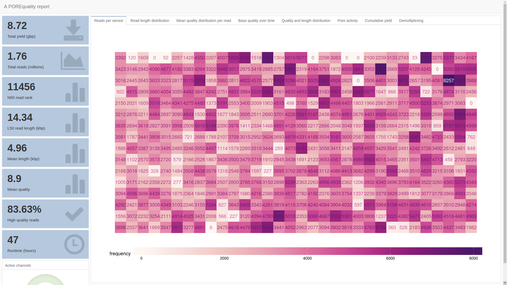
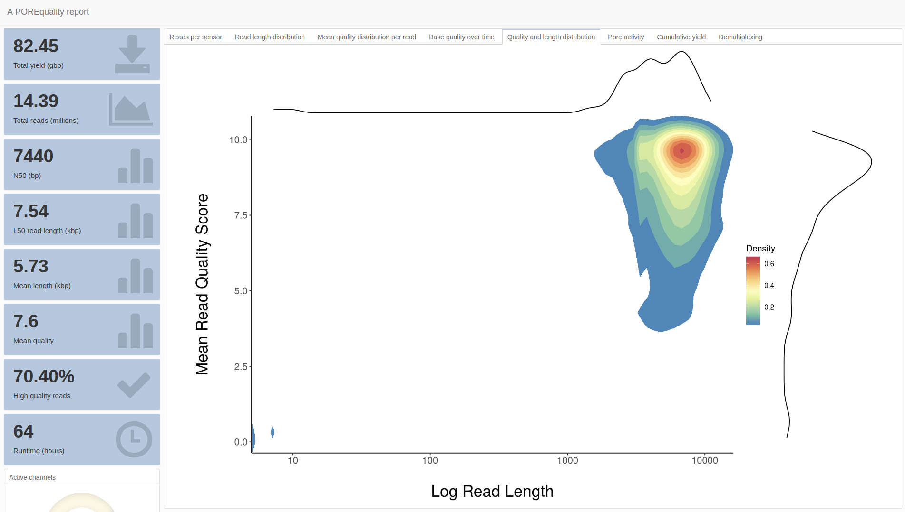
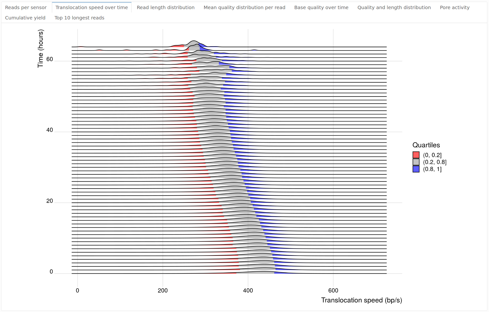

<p align="center"></p>

## POREquality

This is an early version of POREquality, an R Markdown script designed to run as part of a Nanopore local basecalling pipeline. POREquality reads Nanopore sequencing summary files to generate an aesthetically pleasing HTML report to faciliate the visualization of key metrics.

* __Reasons to use POREquality__:
    * Produce professional sequencing reports after any locally basecalled MinION or GridION run.
    * Visually inspect information contained in the sequencing summary.
    * Sharing sequencing quality control reports with third-parties.
    * Diagnose problematic or under-performing runs.

## Table of contents

- [Requirements](#requirements)
- [Installation](#installation)
  * [Required R packages](#required-r-packages)
  * [Install with required dependencies](#install-with-required-dependencies)
- [Example usage](#example-usage)
- [Future development](#future-development)
- [Contributing](#contributing)
- [Acknowledgments](#acknowledgments)
- [Cite](#cite)
- [License](#license)
    
<p align="center"></p>
<p align="center"></p>
<p align="center"></p>
    
## Requirements

POREquality has currently only been tested on Ubuntu, although provided the dependencies are met it (in theory) should be able to run on other operating systems. POREquality requires pandoc to be installed, which we recommend you do via your package manager. Currently these R packages are required:

   * data.table
   * flexdashboard
   * dplyr
   * DT
   * plyr
   * ggExtra
   * ggplot2
   * hexbin
   * knitr
   * optparse
   * RColorBrewer
   * reshape2
   * ggridges
   * scales
    
## Installation

### Required R packages

```r
required.packages <- c("data.table","flexdashboard","dplyr","DT","plyr","ggExtra","ggplot2","hexbin","knitr","optparse","RColorBrewer","reshape2","ggridges","scales")
new.packages <- required.packages[!(required.packages %in% installed.packages()[,"Package"])]
if(length(new.packages)) install.packages(new.packages)
```

### Install with required dependencies

```bash
git clone https://github.com/carsweshau/POREquality
cd POREquality
sudo apt-get install pandoc
```

## Example usage

The (rather boorish) bash code below could be placed in a script and ran via cron:

```bash
NUMBER_OF_ACTIVE_RUNS=$(ps -ef | grep MinKNOW | grep experiment | grep sequencing | grep -v \"grep\" | wc -l)
if [ $NUMBER_OF_ACTIVE_RUNS -gt 0 ]; then
  exit 1 # files are still being written, will check later via cron
fi

cd /data/basecalled # assumes GridION data structure
for run in *; do
    if [[ -f $run ]]; then
        continue;
    fi
    if [[ $run != "workspace" ]]; then
        if [ ! -f ${dir}_summary.txt ]; then
      cat ${dir}/GA?0000/seq*.txt > ${dir}_raw_summary.txt # creating an intermediate file is distasteful here, you could grep off a header and append to your liking
      awk ' /^filename/ && FNR > 1 {next} {print $0} ' ${dir}_raw_summary.txt > ${dir}_summary.txt && rm /data/basecalled/${dir}_raw_summary.txt
    fi
        if [ ! -f /data/reports/${run}.html ]; then
            Rscript -e "rmarkdown::render('/home/USER/POREquality/POREquality.Rmd', output_file=paste('/data/reports/${run}.html',sep=''))" -i /data/basecalled/${run}_summary.txt -o /data/reports
        fi
    fi
done
```

Alternatively, one could just run the Rscript supplying the required sequencing summary.

## Future development

   * ~~Ensure the new re-factored code accepts any ONT sequencing summary gracefully~~
   * ~~Add PromethION support (physical flowcell layout, ensure compatiable with existing workflows, etc)~~
   * Simplify installation of POREquality via dependency management like [Packrat](https://rstudio.github.io/packrat/)
   * Add in bream log support for interrogation of drift voltages, etc.
   * Refactor R code to use fewer packages and embrace data.table to enable key-value/set operations for performance
    
## Contributing

As this is my first release, I would greatly appreciate any feedback to improve POREquality! I welcome the Nanopore community to offer insight and to contribute to the ongoing development of POREquality by either submitting issues [issues](https://github.com/carsweshau/POREquality/issues) or [pull requests](https://github.com/carsweshau/POREquality/pulls).

## Acknowledgments

I would like to thank [Dr. Martin Smith](https://twitter.com/martinalexsmith) for the patient encouragment, as well as the rest of the [Genomic Technologies Group](https://www.garvan.org.au/research/kinghorn-centre-for-clinical-genomics/clinical-genomics/programs/genomic-technologies), [Dr. Kirston Barton](@DrKirston) and [James Ferguson](@Psy_Fer_) for all their hard work and advice.

Furthermore, the wider Nanopore community is a fantastic and welcoming place, and there are many aspects of POREquality which could not exist were it not for the hard work of many others providing this environment.

## Cite

[](https://zenodo.org/badge/latestdoi/141090375)

Shaun L. Carswell, & Martin A. Smith. (2019, January 30). carsweshau/POREquality: Pre-release of POREquality alpha (Version v0.9.8). Zenodo. <https://doi.org/10.5281/zenodo.2552922>

## License

[MIT License](https://opensource.org/licenses/MIT)
